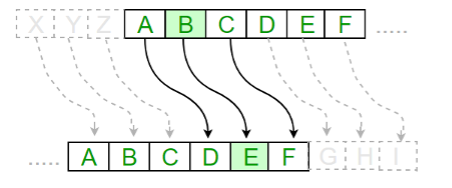

# Caesar Cipher

The Caesar cipher is a simple way of scrambling messages to keep them secret. It's named after Julius Caesar, who used it to encrypt his military messages.

The cipher implementation requires you to shift each letter a certain number of spots down the alphabet.

For example, if you shift by `1`, `A` becomes `B`, `B` becomes `C`, and so on. With a shift of `3`, `A` becomes `D`, `B` becomes `E`, and so on.

To decrypt the message, you just shift the letters back by the same number.

## Instructions

This challenge asks you to develop a solution that can transform messages into a secret code based on the Caesar Cipher implementation, and then reverse the process to reveal the original message.

### Requirements
- You only need to support an input of A-Z, 0-9, spaces, underscores, and dashes (39 characters in total)
- If the input string contains additional characters than you can throw an exception
- The solution should support an unlimited length of input
