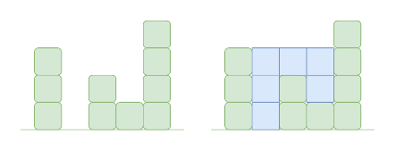
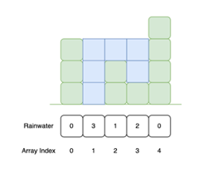

# Capturing Rainwater

Imagine a landscape with hills and valleys.

When it rains, the valleys will start to collect water, but they can only store as much water as the height of the hill.

## Introduction

This challenge asks you to create a program to find the maximum amount of rainwater that could be trapped between each "hill".

The amount of water to be stored in every position can be found by finding the heights of bars on the left and right sides. 

The total amount of water stored is the summation of the water stored in each index.

Imagine the array `[3, 0, 2, 1, 4]` representing hills and valleys (like in the diagram below). 

The valley between the first two hills (index 1) can hold `3` units of water. Similarly, the next two valleys (indexes 2 and 3) can hold 1 and 2 units of water respectively.

